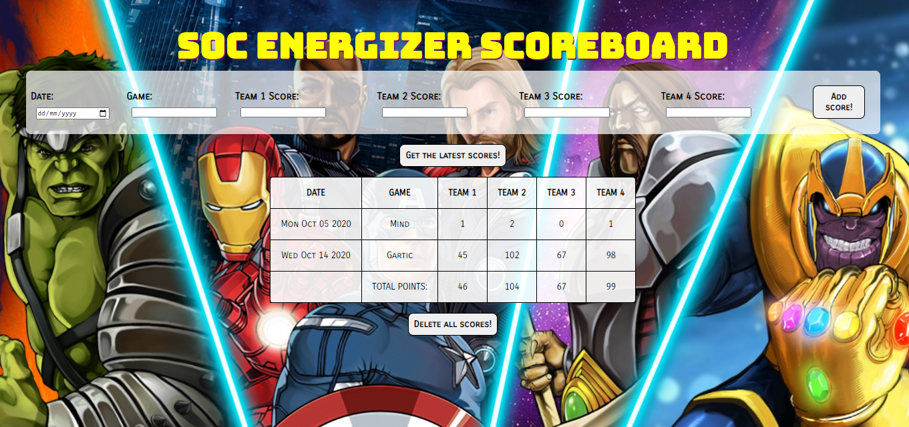

# Team Game Scoreboard

#### School of Code Bootcamp - Hackathon Week 4

###### October 2020

_Our Week 4 hackathon challenge was to build our first full stack app using Express and a Postgres database. It was a chance to embed everything we'd learnt so far on the bootcamp and great practice of breaking down problems into solvable chunks. I was so happy that I was able to make my first full-stack app with no help after just 4 weeks on the bootcamp - it felt awesome!_

## Hackathon Requirements

- Must use a Database for persistent storage
- Must use the model pattern to allow easy interaction with the data
- Must use an REST API server to manage requests and serve back data
- Must have a front end which allows users to at least view the data

## Main Learning Points:

- Making a detailed plan before we started doing any coding was essential and meant that we keep on track throughout the hackathon
- Reading errors messages and deciphering them! I'm learning to enjoy getting error messages and the problem solving that comes with fixing the bugs!
- Creating and building an Express app
- Using environment variables
- Getting more confident with connecting the backend and frontend together - I'm getting much better and quicker at this!
- Using PostgreSQL and creating a database with Heroku
- Writing scripts for our database, writing models and routes (`GET`, `POST` and `DELETE` all) for our backend functionality
- Displaying the data we received from the backend on the frontend. I was really pleased with how the data was presented in the table.

## Stretch Goals:

- Add functionality to delete rows by ID

## Built with:

- HTML
- CSS
- JavaScript
- Express
- PostgreSQL
- Heroku

## Getting Started:

Clone the repo as instructed below

## Prerequisites:

Download and install npm modules. Add .env file for local usage. You will need a Postgres database and credentials. (I made a free on with Heroku)

## Installation

1.  Clone the repo

`git clone https://github.com/katiehawcutt/team-game-scoreboard.git`

2. Install the required npm modules

`npm i`

3. Add a .env file in the root of the folder and enter your database credentials:

`PGHOST= your host details here`
`PGDATABASE= your db details here`
`PGUSER= your user data`
`PGPORT= your port number here`
`PGPASSWORD= your password here`

4. Start the application

`npm start`

5. Go to `localhost:3000` to view the application

## Usage

View and add scores to the table
